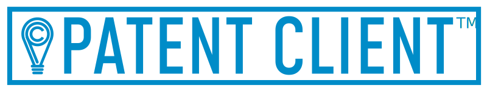

[](https://patent-client.readthedocs.io)

[](https://github.com/parkerhancock/patent_client/actions/workflows/build.yaml)
[](https://codecov.io/gh/parkerhancock/patent_client)
[](https://patent-client.readthedocs.io/en/stable/)


[](https://pypi.org/project/patent-client)
[](https://pypi.org/project/patent-client)
[](https://pypi.org/project/patent-client)

# Summary

A powerful library for accessing intellectual property, featuring:

- 🍰 **Ease of use:** All sources use a simple unified API inspired by [Django-ORM][DORM].
- 🐼 **Pandas Integration:** Results are easily castable to [Pandas Dataframes and Series][PANDAS].
- 🚀 **Performance:** Fetched data is cached using the excellent [requests-cache][requests-cache] library for super-fast queries.

Docs, including a fulsome Getting Started and User Guide are available on [Read the Docs](http://patent-client.readthedocs.io). The Examples folder includes examples of using `patent_client` for
many common IP tasks

## Coverage

- [United States Patent & Trademark Office][USPTO]

  - [Patent Full Text Databases][PATFT] - Full Support
  - [Patent Examination Data][PEDS] - Full Support
  - [Patent Assignment Data][Assignment] - Lookup Support
  - [Patent Trial & Appeal Board API v2][PTAB] - Supports Proceedings, Decisions, and Documents


- [European Patent Office - Open Patent Services][OPS]

  - Inpadoc - Full Support
  - EPO Register - No Support (in progress)
  - Classification - No Support

* Free software: Apache Software License 2.0

[DORM]: https://docs.djangoproject.com/en/4.0/topics/db/queries/
[PANDAS]: https://pandas.pydata.org/docs/
[requests-cache]: https://github.com/requests-cache/requests-cache
[Assignment]: https://developer.uspto.gov/api-catalog/patent-assignment-search-beta
[OPS]: http://ops.epo.org
[PATFT]: http://http://patft.uspto.gov/
[PEDS]: https://developer.uspto.gov/api-catalog/ped
[PTAB]: https://developer.uspto.gov/api-catalog/ptab-api-v2
[USPTO]: http://developer.uspto.gov


## Installation

```
pip install patent_client
```

If you only want access to USPTO resources, you're done!
However, additional setup is necessary to access EPO Inpadoc and EPO Register resources. See the [Docs](http://patent-client.readthedocs.io).


## Quick Start

To use the project:

```python
# Import the model classes you need
>>> from patent_client import Inpadoc, Assignment, USApplication, Patent

# Fetch US Patents with the word "tennis" in their title issued in 2010
>>> pats = Patent.objects.filter(title="tennis", issue_date="2010-01-01->2010-12-31")
>>> len(pats) > 10
True

# Look at the first one
>>> pats[0].publication
Patent(publication_number=7841958, publication_date=2010-11-30, title=Modular table tennis game)

# Fetch US Applications
>>> app = USApplication.objects.get('15710770')
>>> app.patent_title
'Camera Assembly with Concave-Shaped Front Face'

# Fetch from USPTO Assignments
>>> assignments = Assignment.objects.filter(assignee='Google')
>>> len(assignments) > 23000
True
>>> assignment = Assignment.objects.get('47086-788')
>>> assignment.conveyance_text
'ASSIGNMENT OF ASSIGNORS INTEREST'

# Fetch from INPADOC
>>> pub = Inpadoc.objects.get('EP3082535A1')
>>> pub.biblio.title
'AUTOMATIC FLUID DISPENSER'

```
<!-- RTD-IGNORE -->

## Documentation

Docs, including a fulsome Getting Started are available on [Read the Docs](http://patent-client.readthedocs.io).

<!-- END-RTD-IGNORE -->

# Development

To run the all tests run:

```
pytest
```

A developer guide is provided in the [Documentation](http://patent-client.readthedocs.io).
Pull requests welcome!

# Related projects

- [Python EPO OPS Client](https://github.com/55minutes/python-epo-ops-client)
- [Google Public Patent Data](https://github.com/google/patents-public-data)
- [PatentsView API Wrapper](https://github.com/mikeym88/PatentsView-API-Wrapper)
- [USPTO Scrapy Scraper](https://github.com/blazers08/USPTO)

